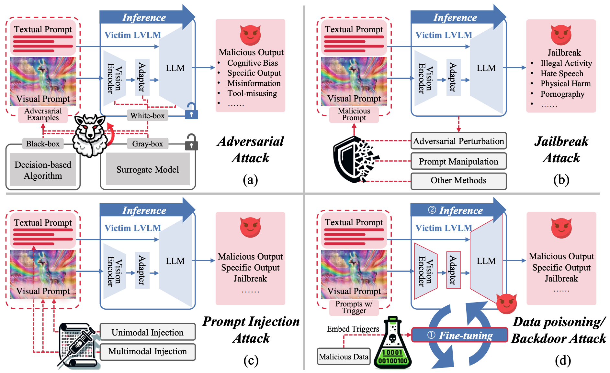

# Awesome-LVLM-Attack [](https://github.com/sindresorhus/awesome)
A **continual** collection of papers related to Attacks on Large-Vision-Language-Models (LVLMs).

Large vision-language models (LVLMs) have achieved significant success and demonstrated promising capabilities in various multimodal downstream tasks.
Despite their remarkable capabilities, the increased complexity and deployment of LVLMs have also exposed them to various security threats and vulnerabilities, making the study of attacks on these models a critical area of research.

Here, we've summarized existing LVLM Attack methods in our survey paper👍.

[A Survey of Attacks on Large Vision-Language Models: Resources, Advances, and Future Trends](https://arxiv.org/abs/2407.07403)

> If you find some important work missed, it would be super helpful to let me know (`dzliu@stu.pku.edu.cn`). Thanks!

> If you find our survey useful for your research, please consider citing:

```
@article{liu2024attack,
  title={A Survey of Attacks on Large Vision-Language Models: Resources, Advances, and Future Trends},
  author={Liu, Daizong and Yang, Mingyu and Qu, Xiaoye and Zhou, Pan and Hu, Wei and Cheng, Yu},
  journal={arXiv preprint arXiv:2407.07403},
  year={2024}
}
```

**Table of Contents**
- [Adversarial Attacks](#Adversarial-Attack)
- [Jailbreack Attacks](#Jailbreack-Attack)
- [Prompt Injection](#Prompt-Injection)
- [Data Poisoning](#Data-Poisoning)

<div align=center></div>

---

## Adversarial-Attack
* **On the Adversarial Robustness of Multi-Modal Foundation Models** | 
  * Christian Schlarmann, Matthias Hein
  * University of Tubingen
  * [ICCVworkshop2023] https://openaccess.thecvf.com/content/ICCV2023W/AROW/papers/Schlarmann_On_the_Adversarial_Robustness_of_Multi-Modal_Foundation_Models_ICCVW_2023_paper.pdf
* **On Evaluating Adversarial Robustness of Large Vision-Language Models** | [Github](https://github.com/yunqing-me/AttackVLM)
  * Yunqing Zhao, Tianyu Pang, Chao Du, Xiao Yang, Chongxuan Li, Ngai-Man Cheung, Min Lin
  * Singapore University of Technology and Design, Sea AI Lab, Tsinghua University, Renmin University of China
  * [NeurIPs2023] https://arxiv.org/abs/2305.16934
* **VLATTACK: Multimodal Adversarial Attacks on Vision-Language Tasks via Pre-trained Models** | [Github](https://github.com/ericyinyzy/VLAttack)
  * Ziyi Yin, Muchao Ye, Tianrong Zhang, Tianyu Du, Jinguo Zhu, Han Liu, Jinghui Chen, Ting Wang, Fenglong Ma
  * The Pennsylvania State University, Zhejiang University, Xi’an Jiaotong University, Dalian University of Technology, Stony Brook University
  * [NeurIPs2023] [https://arxiv.org/abs/2312.03777](https://arxiv.org/abs/2310.04655)
* **Adversarial Illusions in Multi-Modal Embeddings** | [Github](https://github.com/ebagdasa/adversarial_illusions)
  * Tingwei Zhang, Rishi Jha, Eugene Bagdasaryan, Vitaly Shmatikov
  * Cornell University, Cornell Tech
  * [Arxiv2023] https://arxiv.org/abs/2308.11804
* **Image Hijacks: Adversarial Images can Control Generative Models at Runtime** | [Github](https://github.com/euanong/image-hijacks)
  * Luke Bailey, Euan Ong, Stuart Russell, Scott Emmons
  * UC Berkeley, Harvard University, University of Cambridge
  * [Arxiv2023] https://arxiv.org/abs/2309.00236
* **How Robust is Google's Bard to Adversarial Image Attacks?** | [Github](https://github.com/thu-ml/Attack-Bard)
  * Yinpeng Dong, Huanran Chen, Jiawei Chen, Zhengwei Fang, Xiao Yang, Yichi Zhang, Yu Tian, Hang Su, Jun Zhu
  * Tsinghua University, RealAI
  * [Arxiv2023] https://arxiv.org/abs/2309.11751
* **Misusing Tools in Large Language Models With Visual Adversarial Examples** | 
  * Xiaohan Fu, Zihan Wang, Shuheng Li, Rajesh K. Gupta, Niloofar Mireshghallah, Taylor Berg-Kirkpatrick, Earlence Fernandes
  * University of California San Diego, University of Washington
  * [Arxiv2023] https://arxiv.org/abs/2310.03185
* **How Many Unicorns Are in This Image? A Safety Evaluation Benchmark for Vision LLMs** | [Github](https://github.com/UCSC-VLAA/vllm-safety-benchmark)
  * Haoqin Tu, Chenhang Cui, Zijun Wang, Yiyang Zhou, Bingchen Zhao, Junlin Han, Wangchunshu Zhou, Huaxiu Yao, Cihang Xie
  * UC Santa Cruz, UNC-Chapel Hill, University of Edinburgh, University of Oxford, AIWaves Inc.
  * [Arxiv2023] https://arxiv.org/abs/2311.16101
* **InstructTA: Instruction-Tuned Targeted Attack for Large Vision-Language Models** | 
  * Xunguang Wang, Zhenlan Ji, Pingchuan Ma, Zongjie Li, Shuai Wang
  * The Hong Kong University of Science and Technology
  * [Arxiv2023] https://arxiv.org/abs/2312.01886
* **OT-Attack: Enhancing Adversarial Transferability of Vision-Language Models via Optimal Transport Optimization** | 
  * Dongchen Han, Xiaojun Jia, Yang Bai, Jindong Gu, Yang Liu, Xiaochun Cao
  *  Sun Yat-sen University, Nanyang Technological University, Tsinghua University, University of Oxford
  * [Arxiv2023] https://arxiv.org/abs/2312.04403
* **An Image Is Worth 1000 Lies: Transferability of Adversarial Images across Prompts on Vision-Language Models** | [Github](https://github.com/Haochen-Luo/CroPA)
  * Haochen Luo, Jindong Gu, Fengyuan Liu, Philip Torr
  * University of Oxford
  * [ICLR2024] https://arxiv.org/abs/2403.09766
* **Inducing High Energy-Latency of Large Vision-Language Models with Verbose Images** | [Github](https://github.com/KuofengGao/Verbose_Images)
  * Kuofeng Gao, Yang Bai, Jindong Gu, Shu-Tao Xia, Philip Torr, Zhifeng Li, Wei Liu
  * Tsinghua University, Tencent Technology (Beijing),  University of Oxford, Tencent Data Platform, Peng Cheng Laboratory
  * [ICLR2024] https://arxiv.org/abs/2401.11170
* **Adversarial Robustness for Visual Grounding of Multimodal Large Language Models** | 
  * Kuofeng Gao, Yang Bai, Jiawang Bai, Yong Yang, Shu-Tao Xia
  * Tsinghua University, Tencent Security Platform, Peng Cheng Laboratory
  * [ICLRworkshop2024] https://arxiv.org/abs/2405.09981
* **Transferable Multimodal Attack on Vision-Language Pre-training Models** | 
  * Haodi Wang, Kai Dong, Zhilei Zhu, Haotong Qin, Aishan Liu, Xiaolin Fang, Jiakai Wang, Xianglong Liu
  * Southeast University, Data Space Research Institute of Hefei Comprehensive National Science Centre, Beihang University, Southeast University, Zhongguancun Laboratory
  * [S&P2024] https://www.computer.org/csdl/proceedings-article/sp/2024/313000a102/1Ub239H4xyg
* **On the Safety Concerns of Deploying LLMs/VLMs in Robotics: Highlighting the Risks and Vulnerabilities** | 
  * Xiyang Wu, Ruiqi Xian, Tianrui Guan, Jing Liang, Souradip Chakraborty, Fuxiao Liu, Brian Sadler, Dinesh Manocha, Amrit Singh Bedi
  * University of Maryland, Army Research Laboratory, University of Central Florida
  * [Arxiv2024] https://arxiv.org/abs/2402.10340
* **The Wolf Within: Covert Injection of Malice into MLLM Societies via an MLLM Operative** | [Github](https://github.com/ChengshuaiZhao0/The-Wolf-Within)
  * Zhen Tan, Chengshuai Zhao, Raha Moraffah, Yifan Li, Yu Kong, Tianlong Chen, Huan Liu
  * Arizona State University, Michigan State University, Harvard University
  * [Arxiv2024] https://arxiv.org/abs/2402.14859
* **Stop Reasoning! When Multimodal LLMs with Chain-of-Thought Reasoning Meets Adversarial Images** | 
  * Zefeng Wang, Zhen Han, Shuo Chen, Fan Xue, Zifeng Ding, Xun Xiao, Volker Tresp, Philip Torr, Jindong Gu
  * Technical University of Munich, Ludwig Maximilian University of Munich, Huawei Munich Research Center, University of Oxford
  * [Arxiv2024] https://arxiv.org/abs/2402.14899
* **AVIBench: Towards Evaluating the Robustness of Large Vision-Language Model on Adversarial Visual-Instructions** | 
  * Hao Zhang, Wenqi Shao, Hong Liu, Yongqiang Ma, Ping Luo, Yu Qiao, Kaipeng Zhang
  * Xi’an Jiaotong University, Shanghai Artificial Intelligence Laboratory, Osaka University
  * [Arxiv2024] https://arxiv.org/abs/2403.09346
* **Efficiently Adversarial Examples Generation for Visual-Language Models under Targeted Transfer Scenarios using Diffusion Models** | 
  * Qi Guo, Shanmin Pang, Xiaojun Jia, Qing Guo
  * Xi’an Jiaotong University, Nanyang Technological University, Center for Frontier AI Research
  * [Arxiv2024] https://arxiv.org/abs/2404.10335
* **Adversarial Attacks on Multimodal Agents** | 
  * Chen Henry Wu, Jing Yu Koh, Ruslan Salakhutdinov, Daniel Fried, Aditi Raghunathan
  * Carnegie Mellon University
  * [Arxiv2024] https://arxiv.org/abs/2406.12814
* **Refusing Safe Prompts for Multi-modal Large Language Models** | 
  * Zedian Shao, Hongbin Liu, Yuepeng Hu, Neil Zhenqiang Gong
  * Duke University
  * [Arxiv2024] https://arxiv.org//abs/2407.09050
* **Manipulation Facing Threats: Evaluating Physical Vulnerabilities in End-to-End Vision Language Action Models** | #
  * Hao Cheng, Erjia Xiao, Chengyuan Yu, Zhao Yao, Jiahang Cao, Qiang Zhang, Jiaxu Wang, Mengshu Sun, Kaidi Xu, Jindong Gu, Renjing Xu
  * The Hong Kong University of Science and Technology, University of Oxford, Hohai University, Hunan University, Drexel University, Beijing University of Technology
  * [Arxiv2024] https://arxiv.org/abs/2409.13174
* **AnyAttack: Towards Large-scale Self-supervised Generation of Targeted Adversarial Examples for Vision-Language Models** | [Github]([https://github.com/ThuCCSLab/FigStep](https://github.com/jiamingzhang94/AnyAttack)) #
  * Jiaming Zhang, Junhong Ye, Xingjun Ma, Yige Li, Yunfan Yang, Jitao Sang, Dit-Yan Yeung
  * Hong Kong University of Science and Technology, Beijing Jiaotong University, Fudan University, Singapore Management University
  * [Arxiv2024] https://arxiv.org//abs/2410.05346
* **On the Robustness of Large Multimodal Models Against Image Adversarial Attacks** |
  * Xuanming Cui, Alejandro Aparcedo, Young Kyun Jang, Ser-Nam Lim
  * University of Central Florida
  * [CVPR2024] https://openaccess.thecvf.com/content/CVPR2024/papers/Cui_On_the_Robustness_of_Large_Multimodal_Models_Against_Image_Adversarial_CVPR_2024_paper.pdf
* **Exploring the Transferability of Visual Prompting for Multimodal Large Language Models** | [Github](https://github.com/zycheiheihei/Transferable-Visual-Prompting) #
  * Yichi Zhang, Yinpeng Dong, Siyuan Zhan, Tianzan Min, Hang Su, Jun Zhu
  * Tsinghua University, RealAI, Pazhou Laboratory (Huangpu)
  * [CVPR2024] https://openaccess.thecvf.com/content/CVPR2024/papers/Zhang_Exploring_the_Transferability_of_Visual_Prompting_for_Multimodal_Large_Language_CVPR_2024_paper.pdf
* **Break the Visual Perception: Adversarial Attacks Targeting Encoded Visual Tokens of Large Vision-Language Models** | #
  * Yubo Wang, Chaohu Liu, Yanqiu Qu, Haoyu Cao, Deqiang Jiang, Linli Xu
  * University of Science and Technology of China, Tencent YouTu Lab
  * [ACMMM2024] https://arxiv.org/abs/2410.06699

## Jailbreak-Attack
* **Are aligned neural networks adversarially aligned?** | 
  * Nicholas Carlini, Milad Nasr, Christopher A. Choquette-Choo, Matthew Jagielski, Irena Gao, Anas Awadalla, Pang Wei Koh, Daphne Ippolito, Katherine Lee, Florian Tramer, Ludwig Schmidt
  * Google DeepMind, Stanford, University of Washington, ETH Zurich
  * [NeurIPs2023] https://arxiv.org/abs/2306.15447
* **FigStep: Jailbreaking Large Vision-language Models via Typographic Visual Prompts** | [Github](https://github.com/ThuCCSLab/FigStep)
  * Yichen Gong, Delong Ran, Jinyuan Liu, Conglei Wang, Tianshuo Cong, Anyu Wang, Sisi Duan, Xiaoyun Wang
  * Tsinghua University, Shandong University, Carnegie Mellon University
  * [Arxiv2023] https://arxiv.org/abs/2311.05608
* **Jailbreaking GPT-4V via Self-Adversarial Attacks with System Prompts** | 
  * Yuanwei Wu, Xiang Li, Yixin Liu, Pan Zhou, Lichao Sun
  * Huazhong University of Science and Technology, Lehigh University
  * [Arxiv2023] https://arxiv.org/abs/2311.09127
* **MM-SafetyBench: A Benchmark for Safety Evaluation of Multimodal Large Language Models** | [Github](https://github.com/isXinLiu/MM-SafetyBench)
  * Xin Liu, Yichen Zhu, Jindong Gu, Yunshi Lan, Chao Yang, Yu Qiao
  * Shanghai AI Laboratory, East China Normal University, Midea Group, University of Oxford
  * [Arxiv2023] https://arxiv.org/abs/2311.17600
* **Visual Adversarial Examples Jailbreak Aligned Large Language Models** | [Github](https://github.com/Unispac/Visual-Adversarial-Examples-Jailbreak-Large-Language-Models)
  * Xiangyu Qi, Kaixuan Huang, Ashwinee Panda, Peter Henderson, Mengdi Wang, Prateek Mittal
  * Princeton University, Stanford University
  * [AAAI2024] https://arxiv.org/abs/2306.13213
* **Jailbreak in pieces: Compositional Adversarial Attacks on Multi-Modal Language Models** | 
  * Erfan Shayegani, Yue Dong, Nael Abu-Ghazaleh
  * University of California
  * [ICLR2024] https://arxiv.org/abs/2307.14539
* **Agent Smith: A Single Image Can Jailbreak One Million Multimodal LLM Agents Exponentially Fast** | [Github](https://github.com/sail-sg/Agent-Smith)
  * Xiangming Gu, Xiaosen Zheng, Tianyu Pang, Chao Du, Qian Liu, Ye Wang, Jing Jiang, Min Lin
  * Sea AI Lab, National University of Singapore, Singapore Management University
  * [ICML2024] https://arxiv.org/abs/2402.08567
* **Learning To See But Forgetting To Follow: Visual Instruction Tuning Makes LLMs More Prone To Jailbreak Attacks** | [Github](https://github.com/gpantaz/vl_jailbreak)
  * Georgios Pantazopoulos, Amit Parekh, Malvina Nikandrou, Alessandro Suglia
  * Heriot-Watt University
  * [COLINGworkshop2024] https://arxiv.org/abs/2405.04403
* **Jailbreaking Attack against Multimodal Large Language Model** | 
  * Zhenxing Niu, Haodong Ren, Xinbo Gao, Gang Hua, Rong Jin
  * Xidian University, Wormpex AI Research, Meta
  * [Arxiv2024] https://arxiv.org/abs/2402.02309
* **ImgTrojan: Jailbreaking Vision-Language Models with ONE Image** | [Github](https://github.com/xijia-tao/ImgTrojan)
  * Xijia Tao, Shuai Zhong, Lei Li, Qi Liu, Lingpeng Kong
  * The University of Hong Kong
  * [Arxiv2024] https://arxiv.org/abs/2403.02910
* **Images are Achilles' Heel of Alignment: Exploiting Visual Vulnerabilities for Jailbreaking Multimodal Large Language Models** | [Github](https://github.com/AoiDragon/HADES)
  * Yifan Li, Hangyu Guo, Kun Zhou, Wayne Xin Zhao, Ji-Rong Wen
  * Renmin University of China, Beijing Key Laboratory of Big Data Management and Analysis Methods
  * [Arxiv2024] https://arxiv.org/abs/2403.09792
* **Red Teaming GPT-4V: Are GPT-4V Safe Against Uni/Multi-Modal Jailbreak Attacks?** | 
  * Shuo Chen, Zhen Han, Bailan He, Zifeng Ding, Wenqian Yu, Philip Torr, Volker Tresp, Jindong Gu
  * LMU Munich, University of Oxford, Siemens AG, Munich Center for Machine Learning, Wuhan University
  * [Arxiv2024] https://arxiv.org/abs/2404.03411
* **JailBreakV-28K: A Benchmark for Assessing the Robustness of MultiModal Large Language Models against Jailbreak Attacks** | [Github](https://github.com/EddyLuo1232/JailBreakV_28K)
  * Weidi Luo, Siyuan Ma, Xiaogeng Liu, Xiaoyu Guo, Chaowei Xiao
  * The Ohio State University, University of Wisconsin-Madison
  * [Arxiv2024] https://arxiv.org/abs/2404.03027
* **Unbridled Icarus: A Survey of the Potential Perils of Image Inputs in Multimodal Large Language Model Security** | 
  * Yihe Fan, Yuxin Cao, Ziyu Zhao, Ziyao Liu, Shaofeng Li
  * TongJi University, Tsinghua University, Beijing University of Technology, Nanyang Technological University,  Peng Cheng Laboratory
  * [Arxiv2024] https://arxiv.org/abs/2404.05264
* **White-box Multimodal Jailbreaks Against Large Vision-Language Models** | 
  * Ruofan Wang, Xingjun Ma, Hanxu Zhou, Chuanjun Ji, Guangnan Ye, Yu-Gang Jiang
  * Fudan University, Shanghai Jiao Tong University, DataGrand Tech
  * [Arxiv2024] https://arxiv.org/abs/2405.17894
* **From LLMs to MLLMs: Exploring the Landscape of Multimodal Jailbreaking** | 
  * Siyuan Wang, Zhuohan Long, Zhihao Fan, Zhongyu Wei
  * University of Southern California, Fudan University, Alibaba Inc.
  * [Arxiv2024] https://arxiv.org/abs/2406.14859
* **Unveiling the Safety of GPT-4o: An Empirical Study using Jailbreak Attacks** | 
  * Zonghao Ying, Aishan Liu, Xianglong Liu, Dacheng Tao
  * Beihang University, Nanyang Technological University
  * [Arxiv2024] https://arxiv.org/abs/2406.06302
* **Visual-RolePlay: Universal Jailbreak Attack on MultiModal Large Language Models via Role-playing Image Character** | 
  * Siyuan Ma, Weidi Luo, Yu Wang, Xiaogeng Liu
  * University of Wisconsin–Madison, The Ohio State University, Peking University
  * [Arxiv2024] https://arxiv.org/abs/2405.20773
* **Arondight: Red Teaming Large Vision Language Models with Auto-generated Multi-modal Jailbreak Prompts** | 
  * Yi Liu, Chengjun Cai, Xiaoli Zhang, Xingliang Yuan, Cong Wang
  * Stanford, Harvard, Anthropic, Constellation, MIT, UC Berkeley
  * [Arxiv2024] https://arxiv.org/abs/2407.15050
* **When Do Universal Image Jailbreaks Transfer Between Vision-Language Models?** | 
  * Rylan Schaeffer, Dan Valentine, Luke Bailey, James Chua, Cristóbal Eyzaguirre, Zane Durante, Joe Benton, Brando Miranda, Henry Sleight, John Hughes, Rajashree Agrawal, Mrinank Sharma, Scott Emmons, Sanmi Koyejo, Ethan Perez
  * City University of Hong Kong, University of Science and Technology, The University of Melbourne
  * [Arxiv2024] https://arxiv.org/abs/2407.15211
* **MMJ-Bench: A Comprehensive Study on Jailbreak Attacks and Defenses for Vision Language Models** | #
  * Fenghua Weng, Yue Xu, Chengyan Fu, Wenjie Wang
  * ShanghaiTech University
  * [Arxiv2024] https://arxiv.org/abs/2408.08464

## Prompt-Injection
* **Abusing Images and Sounds for Indirect Instruction Injection in Multi-Modal LLMs** | 
  * Eugene Bagdasaryan, Tsung-Yin Hsieh, Ben Nassi, Vitaly Shmatikov
  * Cornell Tech
  * [Arxiv2023] https://arxiv.org/abs/2307.10490
* **Can Language Models be Instructed to Protect Personal Information?** | 
  * Yang Chen, Ethan Mendes, Sauvik Das, Wei Xu, Alan Ritter
  * Georgia Institute of Technology, Carnegie Mellon University
  * [Arxiv2023] https://arxiv.org/abs/2310.02224
* **FigStep: Jailbreaking Large Vision-language Models via Typographic Visual Prompts** | [Github](https://github.com/ThuCCSLab/FigStep)
  * Yichen Gong, Delong Ran, Jinyuan Liu, Conglei Wang, Tianshuo Cong, Anyu Wang, Sisi Duan, Xiaoyun Wang
  * Tsinghua University, Shandong University, Carnegie Mellon University
  * [Arxiv2023] https://arxiv.org/abs/2311.05608
* **MM-SafetyBench: A Benchmark for Safety Evaluation of Multimodal Large Language Models** | [Github](https://github.com/isXinLiu/MM-SafetyBench)
  * Xin Liu, Yichen Zhu, Jindong Gu, Yunshi Lan, Chao Yang, Yu Qiao
  * Shanghai AI Laboratory, East China Normal University, Midea Group, University of Oxford
  * [Arxiv2023] https://arxiv.org/abs/2311.17600
* **MLLM-Protector: Ensuring MLLM's Safety without Hurting Performance** | [Github](https://github.com/pipilurj/MLLM-protector)
  * Renjie Pi, Tianyang Han, Yueqi Xie, Rui Pan, Qing Lian, Hanze Dong, Jipeng Zhang, Tong Zhang
  * The Hong Kong University of Science and Technology, University of Illinois at Urbana-Champaign, The Hong Kong Polytechnic University
  * [Arxiv2024] https://arxiv.org/abs/2401.02906
* **Vision-LLMs Can Fool Themselves with Self-Generated Typographic Attacks** | [Github](https://github.com/mqraitem/Self-Gen-Typo-Attack)
  * Maan Qraitem, Nazia Tasnim, Piotr Teterwak, Kate Saenko, Bryan A. Plummer
  * Boston University
  * [Arxiv2024] https://arxiv.org/abs/2402.00626
* **Safeguarding Vision-Language Models Against Patched Visual Prompt Injectors** | 
  * Jiachen Sun, Changsheng Wang, Jiongxiao Wang, Yiwei Zhang, Chaowei Xiao
  * University of Michigan Ann arbor, University of Wisconsin Madison, University of Science and Technology of China
  * [Arxiv2024] https://arxiv.org/abs/2405.10529
* **Empirical Analysis of Large Vision-Language Models against Goal Hijacking via Visual Prompt Injection** | #
  * Subaru Kimura, Ryota Tanaka, Shumpei Miyawaki, Jun Suzuki, Keisuke Sakaguchi
  * Tohoku University, NTT Corporation
  * [Arxiv2024] https://arxiv.org/abs/2408.03554
* **Manipulation Facing Threats: Evaluating Physical Vulnerabilities in End-to-End Vision Language Action Models** | #
  * Hao Cheng, Erjia Xiao, Chengyuan Yu, Zhao Yao, Jiahang Cao, Qiang Zhang, Jiaxu Wang, Mengshu Sun, Kaidi Xu, Jindong Gu, Renjing Xu
  * The Hong Kong University of Science and Technology, University of Oxford, Hohai University, Hunan University, Drexel University, Beijing University of Technology
  * [Arxiv2024] https://arxiv.org/abs/2409.13174
* **Exploring the Transferability of Visual Prompting for Multimodal Large Language Models** | [Github](https://github.com/zycheiheihei/Transferable-Visual-Prompting) #
  * Yichi Zhang, Yinpeng Dong, Siyuan Zhan, Tianzan Min, Hang Su, Jun Zhu
  * Tsinghua University, RealAI, Pazhou Laboratory (Huangpu)
  * [CVPR2024] https://openaccess.thecvf.com/content/CVPR2024/papers/Zhang_Exploring_the_Transferability_of_Visual_Prompting_for_Multimodal_Large_Language_CVPR_2024_paper.pdf

## Data-Poisoning
* **Shadowcast: Stealthy Data Poisoning Attacks Against Vision-Language Models** | [Github](https://github.com/umd-huang-lab/VLM-Poisoning)
  * Yuancheng Xu, Jiarui Yao, Manli Shu, Yanchao Sun, Zichu Wu, Ning Yu, Tom Goldstein, Furong Huang
  * University of Maryland, College Park, JPMorgan AI Research, University of Waterloo, Salesforce Research
  * [Arxiv2024] https://arxiv.org/abs/2402.06659
* **PoisonedRAG: Knowledge Poisoning Attacks to Retrieval-Augmented Generation of Large Language Models** | [Github](https://github.com/sleeepeer/PoisonedRAG)
  * Wei Zou, Runpeng Geng, Binghui Wang, Jinyuan Jia
  * Pennsylvania State University, Wuhan University, Illinois Institute of Technology
  * [Arxiv2024] https://arxiv.org/abs/2402.07867
* **Test-Time Backdoor Attacks on Multimodal Large Language Models** | [Github](https://github.com/sail-sg/AnyDoor)
  * Dong Lu, Tianyu Pang, Chao Du, Qian Liu, Xianjun Yang, Min Lin
  * Southern University of Science and Technology, Sea AI Lab, University of California
  * [Arxiv2024] https://arxiv.org/abs/2402.08577
* **VL-Trojan: Multimodal Instruction Backdoor Attacks against Autoregressive Visual Language Models** | 
  * Jiawei Liang, Siyuan Liang, Man Luo, Aishan Liu, Dongchen Han, Ee-Chien Chang, Xiaochun Cao
  * Sun Yat-sen University
  * [Arxiv2024] https://arxiv.org/abs/2402.13851
* **Physical Backdoor Attack can Jeopardize Driving with Vision-Large-Language Models** | 
  * Zhenyang Ni, Rui Ye, Yuxi Wei, Zhen Xiang, Yanfeng Wang, Siheng Chen
  * Shanghai Jiao Tong University, University of Illinois Urbana-Champaign, Shanghai AI Laboratory, Multi-Agent Governance & Intelligence Crew
  * [Arxiv2024] https://arxiv.org/abs/2404.12916
* **Revisiting Backdoor Attacks against Large Vision-Language Models** | 
  * Siyuan Liang, Jiawei Liang, Tianyu Pang, Chao Du, Aishan Liu, Ee-Chien Chang, Xiaochun Cao
  * National University of Singapore, Sun Yat-sen University, Beihang University
  * [Arxiv2024] https://arxiv.org/abs/2406.18844
